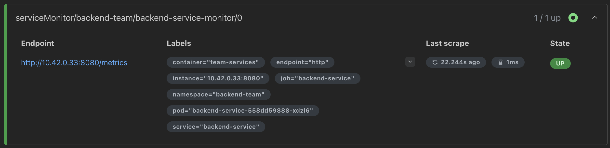

# Multi-tenant Monitoring with Prometheus in Kubernetes

This guide explains how to implement monitoring in a multi-tenant Kubernetes environment using Prometheus Blackbox Exporter and ServiceMonitor. It is designed to help teams set up monitoring for their services in their own namespaces.

## Table of Contents

- [Introduction](#introduction)
- [Blackbox Exporter Probes](#blackbox-exporter-probes)
  - [What are Blackbox Exporter Probes?](#what-are-blackbox-exporter-probes)
  - [Setting up Probes in Your Namespace](#setting-up-probes-in-your-namespace)
  - [Monitoring External Endpoints](#monitoring-external-endpoints)
  - [Probe Configuration Options](#probe-configuration-options)
- [ServiceMonitors](#servicemonitors)
  - [What are ServiceMonitors?](#what-are-servicemonitors)
  - [Setting up ServiceMonitors in Your Namespace](#setting-up-servicemonitors-in-your-namespace)
  - [ServiceMonitor Configuration Options](#servicemonitor-configuration-options)
- [Multi-tenant Best Practices](#multi-tenant-best-practices)
- [Custom Metrics](#custom-metrics)
- [Visualization with Grafana](#visualization-with-grafana)
- [Troubleshooting](#troubleshooting)

## Introduction

In a multi-tenant Kubernetes environment, different teams need to monitor their services independently while sharing the same monitoring infrastructure. This guide explains how teams can deploy monitoring components in their own namespaces while integrating with the central Prometheus stack.

## Blackbox Exporter Probes

### What are Blackbox Exporter Probes?

Blackbox Exporter Probes are Kubernetes custom resources that enable uptime monitoring of endpoints over HTTP, HTTPS, TCP, and ICMP. They allow you to check if your services are responding correctly from an external perspective.


### Setting up Probes in Your Namespace

To set up a Probe in your team's namespace, you need to:

1. Create a Probe custom resource that points to your service endpoint
2. Specify the appropriate monitoring module (HTTP, HTTPS, TCP, etc.)
3. Configure labels to identify the probe as part of your team

Here's an example of a Probe configuration:

```yaml
apiVersion: monitoring.coreos.com/v1
kind: Probe
metadata:
  name: my-service-health
  namespace: your-team-namespace
  labels:
    team: your-team-name
    app: blackbox-exporter
    category: api
  annotations:
    description: "Health check for your service"
spec:
  interval: 30s
  scrapeTimeout: 15s
  module: http_2xx
  targets:
    staticConfig:
      static:
        - http://backend-service.backend-team.svc.cluster.local:8080
  prober:
    url: blackbox-exporter-prometheus-blackbox-exporter:9115
    path: /probe
  metricRelabelings:
    - targetLabel: team
      replacement: your-team-name
    - targetLabel: environment
      replacement: dev
```


Once configured, the Probe will appear as a scrape target in Prometheus. You can verify this in the Prometheus UI under "Targets", where you'll see an entry like this:


The Probe generates several metrics, with the most important one being `probe_success`, which indicates whether the endpoint check passed (1) or failed (0). 

You can query and visualize these metrics in Prometheus:


And in Grafana explore:


Other useful metrics include:
- `probe_duration_seconds`: How long the probe took to complete
- `probe_http_status_code`: The HTTP status code returned (for HTTP probes)

### Monitoring External Endpoints

Teams often need to monitor external dependencies, such as third-party APIs, public websites, or services outside the Kubernetes cluster. Probes are excellent for this purpose as they can check the availability and performance of any HTTP endpoint accessible from your cluster.

Here's an example of a Probe configuration for monitoring an external API:

```yaml
apiVersion: monitoring.coreos.com/v1
kind: Probe
metadata:
  name: external-api-monitor
  namespace: your-team-namespace
  labels:
    team: your-team-name
    app: blackbox-exporter
    category: external-dependency
  annotations:
    description: "Monitor critical external API dependency"
spec:
  interval: 60s  # Less frequent checks for external endpoints
  scrapeTimeout: 30s  # Longer timeout for external calls
  module: https_2xx  # Using HTTPS module for secure external endpoints
  targets:
    staticConfig:
      static:
        - https://api.example.com/health  # External API health endpoint
  prober:
    url: blackbox-exporter-prometheus-blackbox-exporter:9115
    path: /probe
  metricRelabelings:
    - targetLabel: team
      replacement: your-team-name
    - targetLabel: environment
      replacement: production
```

#### Best Practices for External Monitoring

When monitoring external endpoints:

1. **Set appropriate intervals**: External monitoring should typically be less frequent than internal service monitoring to avoid overwhelming external APIs.

2. **Handle authentication**: If the external API requires authentication, you may need to use a custom module in the Blackbox Exporter that includes the necessary headers.

3. **Monitor with purpose**: Only monitor external endpoints that are critical to your service's operation.

4. **Create alerts**: Set up alerts for external dependencies that your service cannot function without.

5. **Consider regional probes**: For globally distributed services, you might want to set up probes in multiple regions to detect regional outages.

### Probe Configuration Options

- **module**: The blackbox exporter module to use (http_2xx, https_2xx, tcp_connect, icmp)
- **interval**: How often to scrape the target
- **scrapeTimeout**: How long before a scrape times out
- **targets**: The target URLs or endpoints to monitor
- **metricRelabelings**: Additional labels to add to the collected metrics

## ServiceMonitors

### What are ServiceMonitors?

ServiceMonitors are Kubernetes custom resources that specify how to scrape metrics from your services. They tell Prometheus which services to monitor and how to collect metrics from them.



### Setting up ServiceMonitors in Your Namespace

To set up a ServiceMonitor in your team's namespace:

1. Ensure your service exposes a metrics endpoint (typically /metrics)
2. Create a ServiceMonitor custom resource that selects your service
3. Configure the endpoint details and scraping interval

Here's an example of a ServiceMonitor configuration:

```yaml
apiVersion: monitoring.coreos.com/v1
kind: ServiceMonitor
metadata:
  name: your-service-monitor
  namespace: your-team-namespace
  labels:
    release: prometheus  # Important: This connects to the central Prometheus
    team: your-team-name
spec:
  selector:
    matchLabels:
      app: your-service-name
  endpoints:
    - port: http  # The service port name that exposes metrics
      interval: 30s
      path: /metrics
```

### ServiceMonitor Configuration Options

- **selector**: Labels to select the services to monitor
- **endpoints**: Specifies how to scrape metrics from the selected services
  - **port**: The named port on the service to scrape
  - **interval**: How often to scrape
  - **path**: The HTTP path where metrics are exposed
- **namespaceSelector**: Optionally select services from specific namespaces

### Custom Metrics

Teams can define custom metrics to monitor specific aspects of their services. These metrics can be exposed through the Prometheus client libraries and collected via ServiceMonitors.


#### Metrics Endpoint Format

When exposing metrics for Prometheus, your service should provide a `/metrics` endpoint that returns data in the Prometheus text-based format. This format follows specific conventions:

1. Each metric has a name, optional labels, and a value
2. Comments are prefixed with `#`
3. Metric types and help text are defined using comments
4. Empty lines are ignored

Here's an example of what a `/metrics` endpoint response should look like:

```
# HELP http_requests_total The total number of HTTP requests.
# TYPE http_requests_total counter
http_requests_total{method="post",code="200"} 1027
http_requests_total{method="post",code="400"} 3
http_requests_total{method="get",code="200"} 845
http_requests_total{method="get",code="404"} 21

# HELP http_request_duration_seconds HTTP request latency in seconds.
# TYPE http_request_duration_seconds histogram
http_request_duration_seconds_bucket{le="0.05"} 24054
http_request_duration_seconds_bucket{le="0.1"} 33444
http_request_duration_seconds_bucket{le="0.2"} 100392
http_request_duration_seconds_bucket{le="+Inf"} 144320
http_request_duration_seconds_sum 53423
http_request_duration_seconds_count 144320

# HELP process_cpu_seconds_total Total user and system CPU time spent in seconds.
# TYPE process_cpu_seconds_total counter
process_cpu_seconds_total 330.1
```

#### Common Metric Types

Prometheus supports several metric types:

1. **Counter**: A cumulative metric that only increases (e.g., number of requests processed)
   ```
   # TYPE api_requests_total counter
   api_requests_total{endpoint="/users"} 8765
   ```

2. **Gauge**: A metric that can increase and decrease (e.g., memory usage, temperature)
   ```
   # TYPE memory_usage_bytes gauge
   memory_usage_bytes 153456128
   ```

3. **Histogram**: Tracks the distribution of values in configurable buckets (e.g., request duration)
   ```
   # TYPE http_request_duration_seconds histogram
   http_request_duration_seconds_bucket{le="0.1"} 12345
   http_request_duration_seconds_bucket{le="0.5"} 45678
   http_request_duration_seconds_bucket{le="1.0"} 56789
   http_request_duration_seconds_bucket{le="+Inf"} 78901
   http_request_duration_seconds_sum 87654.3
   http_request_duration_seconds_count 78901
   ```

4. **Summary**: Similar to histogram but calculates quantiles over a sliding time window
   ```
   # TYPE api_request_duration_seconds summary
   api_request_duration_seconds{quantile="0.5"} 0.043
   api_request_duration_seconds{quantile="0.9"} 0.128
   api_request_duration_seconds{quantile="0.99"} 0.589
   api_request_duration_seconds_sum 1234.5
   api_request_duration_seconds_count 98765
   ```

#### Implementing Custom Metrics

To expose custom metrics in your application:

1. Use a Prometheus client library for your programming language
2. Define and update metrics in your code
3. Expose the metrics on a `/metrics` HTTP endpoint
4. Configure a ServiceMonitor to scrape this endpoint

For example, in a Go application:

```go
import (
    "github.com/prometheus/client_golang/prometheus"
    "github.com/prometheus/client_golang/prometheus/promhttp"
)

var (
    requestsTotal = prometheus.NewCounterVec(
        prometheus.CounterOpts{
            Name: "http_requests_total",
            Help: "Total number of HTTP requests by method and status code",
        },
        []string{"method", "code"},
    )
)

func init() {
    // Register metrics with Prometheus
    prometheus.MustRegister(requestsTotal)
}

func main() {
    // Your application code...
    
    // Increment a metric in your request handler
    requestsTotal.WithLabelValues("get", "200").Inc()
    
    // Expose metrics endpoint
    http.Handle("/metrics", promhttp.Handler())
    http.ListenAndServe(":8080", nil)
}
```

For Java applications (using Micrometer with Spring Boot):

```java
@RestController
public class MyController {
    private final Counter requestsCounter;
    
    public MyController(MeterRegistry registry) {
        this.requestsCounter = Counter.builder("http.requests.total")
            .description("Total number of HTTP requests")
            .tag("endpoint", "/api/data")
            .register(registry);
    }
    
    @GetMapping("/api/data")
    public ResponseEntity<Data> getData() {
        // Increment the counter when endpoint is called
        requestsCounter.increment();
        
        // Your controller logic...
        return ResponseEntity.ok(data);
    }
}
```

Once your metrics are exposed, use a ServiceMonitor to configure Prometheus to scrape them.

## Multi-tenant Best Practices

When implementing monitoring in a multi-tenant environment:

1. **Use consistent labeling**: Apply consistent labels to all monitoring resources to easily filter and group metrics by team, environment, or application.

2. **Namespace isolation**: Keep your monitoring resources in your team's namespace to maintain clear ownership.

3. **Resource limits**: Set appropriate resource requests and limits for your monitoring components to prevent resource contention.

4. **Access control**: Use RBAC to ensure teams can only access their own monitoring resources.

5. **Standardized naming**: Follow a consistent naming convention for your monitoring resources to improve discoverability.


## Visualization with Grafana

Metrics collected by Prometheus can be visualized in Grafana dashboards. The central monitoring team provides shared dashboards, but each team can also create their own dashboards for their specific services.


## Troubleshooting

Common issues and solutions:

1. **Probe not collecting metrics**: 
   - Verify that the blackbox exporter is reachable from your namespace
   - Check that the target URL is accessible
   - Ensure proper labels are set in the Probe resource

2. **ServiceMonitor not working**:
   - Verify the `release: prometheus` label is present
   - Ensure your service has the correct matching labels
   - Check that your service exposes metrics at the specified path

3. **Metrics not showing in Grafana**:
   - Verify that Prometheus is scraping your targets (check Prometheus UI)
   - Ensure you're using the correct metric names in your Grafana queries
   - Check that your metrics have the expected labels 
